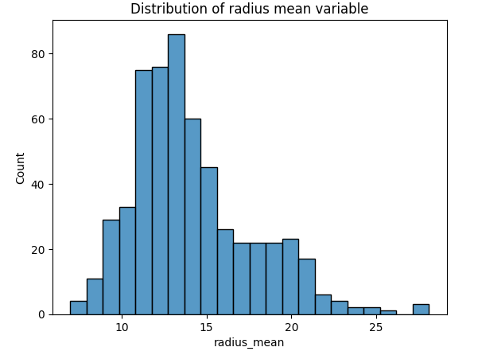
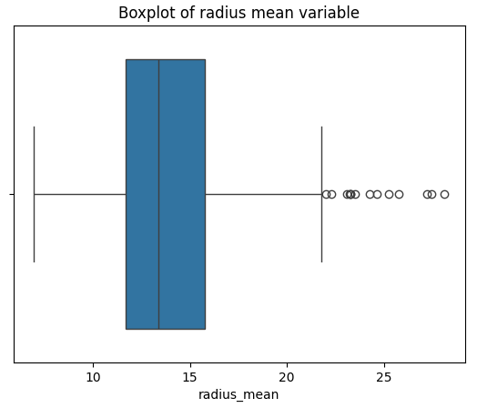
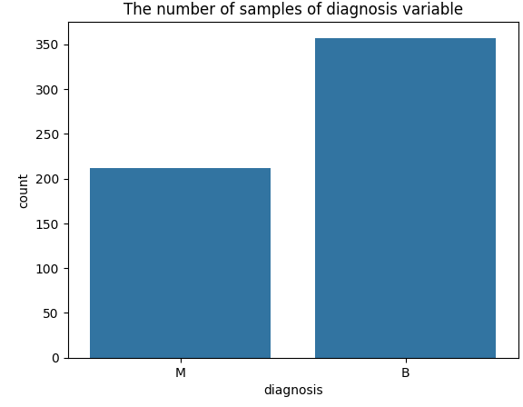
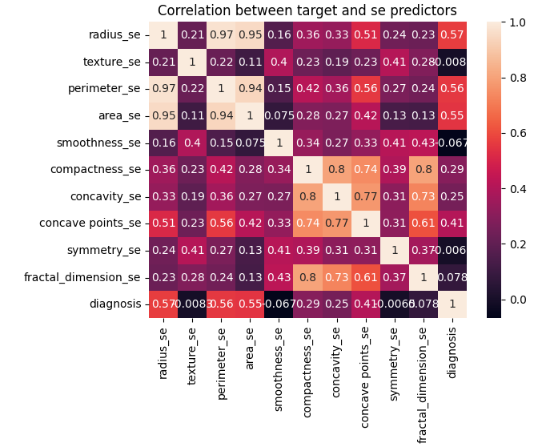

# Breast Cancer Detection Project : Project Overview
* Made a deep learning project that tends to detect female patients who are suffering from a breast cancer tumor according to their medical characteristics with a testing accuracy equals to 92.1 %.
* Collected data to work with from kaggle (a dataset named `Breast Cancer Dataset` within Datasets section).
* Explored our data to extract some relevant insights and patterns and cleaned it up to make it ready for the modeling phase.
* Built an Artificial Neural Network (ANN) from scratch to feed it with our data and try to get the best performance ever from our model.

## Code and Resources used
<b>Python Version :</b> 3.9 
<b>Packages :</b> Numpy, Matplotlib, Seaborn, Pandas, TensorFlow, Scikit-learn 
<b>For Web Framework Requirements :</b> pip install -r requirements.txt

## Data Collection
Collect data from kaggle website to get a dataset that has 569 patients.
With each patient, we got the following :
* Patient ID
* Patient diagnosis (whether a patient has breast cancer or not)
* Mean radius of lobes
* Mean surface texture
* Mean outer perimeter of lobes
* Mean area of lobes
* Mean of smoothness levels
* Mean of compactness
* Mean of concavity
* Mean of concave points
* Mean of symmetry
* Mean of fractal dimension
* Standard Error of radius
* Standard Error of texture
* Standard Error of perimeter
* Standard Error of area
* Standard Error of smoothness
* Standard Error of compactness
* Standard Error of concavity
* Standard Error of concave points
* Standard Error of symmetry
* Standard Error of fractal dimension
* Worst radius
* Worst texture
* Worst perimeter
* Worst area
* Worst smoothness
* Worst compactness
* Worst concavity
* Worst concave points
* Worst symmetry
* Worst fractal dimension
* A useless variable with a null value

## Data Cleaning
Clean the data up to make it ready for modeling process. I made the following changes:
* dropped useless columns (Patient ID & the last column which is unnamed).
* transformed diagnosis variable and made it numerical (B or Benign ---> 0 / M or Malignant ---> 1) so, our data will be ready to feed our model.

## EDA with SQL (Microsoft SQL Server)
I had to explore the data more and try to find relationships between features using SQL (Microsoft SQL Server) by exacuting some queries (12):
* The number of samples according to the diagnosis category
* The average of radius_mean according to the diagnosis category
* The average of texture_mean according to the diagnosis category
* The average of perimeter_mean according to the diagnosis category
* The average of area_mean according to the diagnosis category
* The average of smoothness_mean according to the diagnosis category
* The average of compactness_mean according to the diagnosis category
* The average of concave points_mean according to the diagnosis category
* The average of symmetry_mean according to the diagnosis category
* The average of fractal_dimension_mean according to the diagnosis category
* The number of samples that have their radius_mean above or equal to the average groupped by diagnosis
* Transform each category without an abbreviation using a CASE statement

## EDA with Data Visualization (Matplotlib & Seaborn)
I looked at the distributions of the data, checked for the presence of possible outliers for the various decimal variables and explored the value counts for the target variable (which is the only categorical variable in the dataset) to extract insights and patterns that could be useful in the rest of the project. Below are some of the visualizations I made:   

## Model Building
First, I splitted up data in training and test sets with test size of 20%. I also standardized decimal features using a standard scaler to avoid as much as possible any possibility of model bias. 
I constructed a three-layer artificial neural network from scratch using keras from tensorflow, compiled it using `adam` optimizer, set loss to `sparse_categorical_crossentropy` and metric to `accuracy`. After that, I fed it up with training dataset by setting number of epochs to 10 and validation size as 10% of the data.
* The first layer is a flat one with an input size that equals to the number of independent features.
* The second layer is a normal one with 20 nodes and `relu` as an activation function.
* The last layer is also a normal one with 2 nodes (equals to the number of target categories) and `sigmoid` as an activation function.

## Model Performance
Our deep learning model has performed very well on validation and test sets as we get the following as final results:
* <b>Training accuracy :</b> 96 %
* <b>Validation accuracy :</b> 98 %
* <b>Testing accuracy :</b> 92 %
